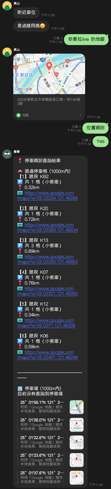

# 🅿️ PapaKing - 台灣停車資訊查詢 LINE Bot

基於 **TDX 運輸資料流通服務** 的停車資訊查詢系統，跑在 Google Apps Script 上，傳一個位置給 LINE Bot 就回附近的停車格與停車場。

## ✨ 特色功能

- 🚗 **路邊停車格** - 依路段分組，顯示路名、小客車格數、費率
- 🏢 **停車場** - 名稱、地址、剩餘車位；新北、基隆另接市府開放資料補 TDX 沒有的場站
- 🕒 **開車時間排序** - 直線最近的幾筆再問 Google 開車時間，依時間重排
- 🗺️ **導航連結** - 每筆一鍵開 Google Maps 導航
- 💬 **Flex 卡片** - LINE Flex Message 排版，超長自動拆訊息
- ☁️ **零伺服器** - Google Apps Script 免費託管，設定全放指令碼屬性

## 📱 功能展示

<div align="center">
  
  <p><i>傳送位置後，Bot 自動回覆附近停車資訊</i></p>
</div>

## 🏗️ 專案結構

```
papaking/
├── gas/
│   ├── line_webhook_gas.js   # 全部程式
│   └── README.md             # 部署步驟、資料來源、配額、測試
├── docs/                     # TDX API 規格
├── image/
└── README.md
```

## 🚀 快速開始

1. 前往 [Google Apps Script](https://script.google.com) 建立新專案，貼上 `gas/line_webhook_gas.js`
2. 在「專案設定 > 指令碼屬性」填 `LINE_CHANNEL_ACCESS_TOKEN` 與 `TDX_KEYS`
3. 部署為 Web App（執行身分：我，存取權：任何人）
4. 把 Web App URL 填進 LINE Developers Console 的 Webhook URL

屬性格式、多把 TDX 金鑰輪替、Google Maps 配額、資料來源與測試函式：見 [gas/README.md](gas/README.md)。
完整部署文件與流程圖：https://www.notion.so/2a37a24cf64081dcbc11c8948ad10337

## 📋 授權條款

本專案採用 **CC BY-NC 4.0** 授權：

### ✅ 非商業使用（免費）
- 個人使用
- 教育用途
- 非營利組織
- 學習研究

### 💼 商業使用（需授權）
如需用於商業用途，請聯繫取得授權：
- 📧 Email: enorenor@gmail.com
- 💻 GitHub: [@coseto6125](https://github.com/coseto6125)

詳見 [LICENSE](LICENSE) 檔案。

## 🙏 致謝

- [TDX 運輸資料流通服務](https://tdx.transportdata.tw/) - 提供停車資料 API
- [LINE Developers](https://developers.line.biz/) - LINE Bot 平台

## 📞 聯絡方式

- 作者：coseto6125
- Email：enorenor@gmail.com
- GitHub：https://github.com/coseto6125/papaking

---

⭐ 如果這個專案對你有幫助，歡迎給個星星！
